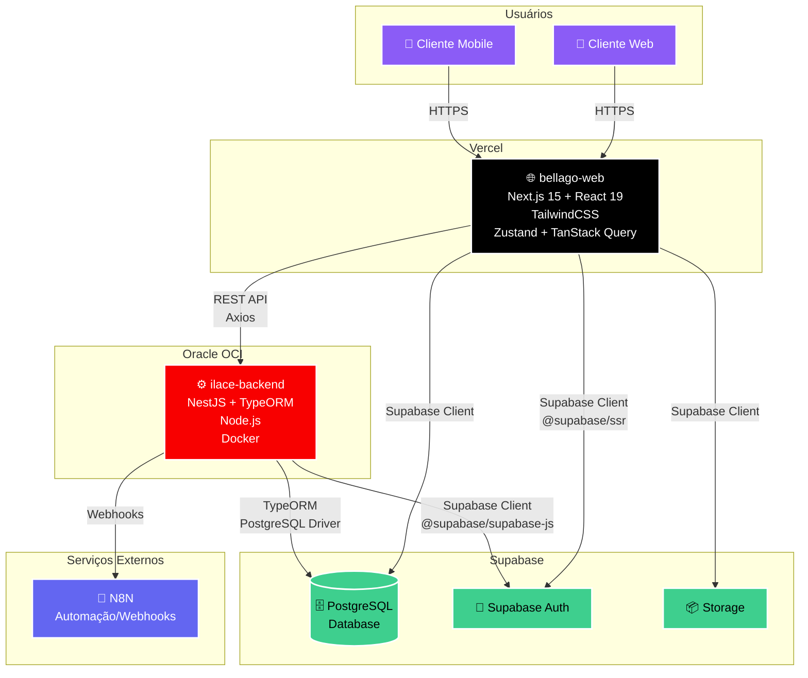

# Arquitetura do Projeto iLace

## Diagrama de Arquitetura

## Descrição dos Componentes

### 🌐 Frontend - bellago-web (Vercel)
- **Framework**: Next.js 15 com React 19
- **Estilização**: TailwindCSS + Radix UI
- **Estado**: Zustand + TanStack Query
- **Comunicação**: 
  - REST API via Axios para o backend
  - Supabase Client para autenticação e banco de dados
- **Deploy**: Vercel (CI/CD automático)

### ⚙️ Backend - ilace-backend (Oracle OCI)
- **Framework**: NestJS
- **ORM**: TypeORM
- **Runtime**: Node.js
- **Containerização**: Docker
- **Principais Módulos**:
  - Appointments (Agendamentos)
  - Auth (Autenticação)
  - Business (Negócios)
  - Professionals (Profissionais)
  - Clients (Clientes)
  - Services (Serviços)
  - Payments (Pagamentos)
  - Notifications (Notificações)
- **Deploy**: Oracle Cloud Infrastructure (OCI)

### 🗄️ Banco de Dados - Supabase
- **Tipo**: PostgreSQL
- **Principais Tabelas**:
  - `business_appointments` - Agendamentos
  - `business_professional_working_hours` - Horários de trabalho
  - `business` - Negócios
  - `business_services` - Serviços oferecidos
  - `clients` - Clientes
  - `professionals` - Profissionais
- **Recursos Adicionais**:
  - Supabase Auth para gerenciamento de usuários
  - Supabase Storage para arquivos

### 🔄 Integrações Externas
- **N8N**: Automação de workflows e webhooks
  - Notificações
  - Integrações com serviços externos

## Fluxo de Dados

1. **Autenticação**: 
   - Usuário faz login pelo frontend
   - Frontend usa Supabase Auth
   - Backend valida tokens JWT

2. **Operações CRUD**:
   - Frontend envia requisições REST para o backend
   - Backend processa e valida
   - Backend persiste no PostgreSQL via TypeORM

3. **Consultas Diretas**:
   - Algumas operações de leitura podem ir direto do frontend para o Supabase
   - Otimiza performance e reduz carga no backend

4. **Webhooks/Notificações**:
   - Backend dispara eventos para N8N
   - N8N executa automações configuradas

## Segurança

- ✅ Autenticação JWT via Supabase
- ✅ HTTPS em todas as conexões
- ✅ Row Level Security (RLS) no Supabase
- ✅ Validações no backend com class-validator
- ✅ Variáveis de ambiente para secrets
- ✅ CORS configurado

## Escalabilidade

- **Frontend**: Escala automaticamente na Vercel (serverless)
- **Backend**: Containerizado com Docker, pode escalar horizontalmente na OCI
- **Banco de Dados**: Supabase gerencia escalabilidade do PostgreSQL
